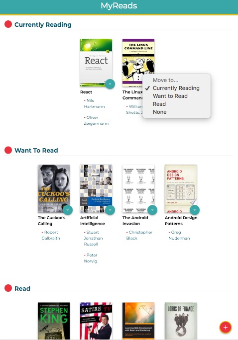
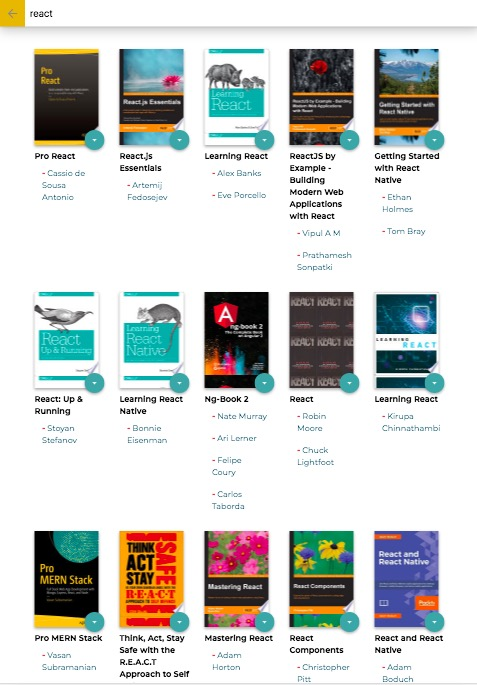

# MyReads Project

[Udacity Project #1 from React Nanodegree](https://www.udacity.com/course/react-nanodegree--nd019)

## Get Started

`yarn` - to install dependencies
`yarn start` - to launch the app on `localhost:3000`

## The Project

- based off starter files: https://github.com/udacity/reactnd-project-myreads-starter
- refactored to use **React 16.13.1** and Hooks
- designed to address rubric set out by Udacity: https://review.udacity.com/#!/rubrics/918/view
- **Home page**: displays books on relevant shelves ('Currently reading', 'Want to Read', 'Read'), with ability to change status via a select dropdown
- **Search page**: ability to search (according to prescribed set of search terms) and add books to shelves

