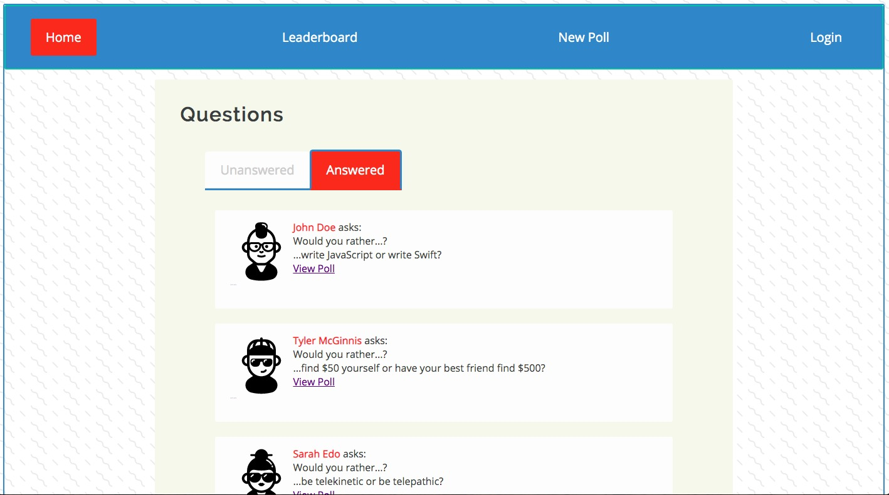
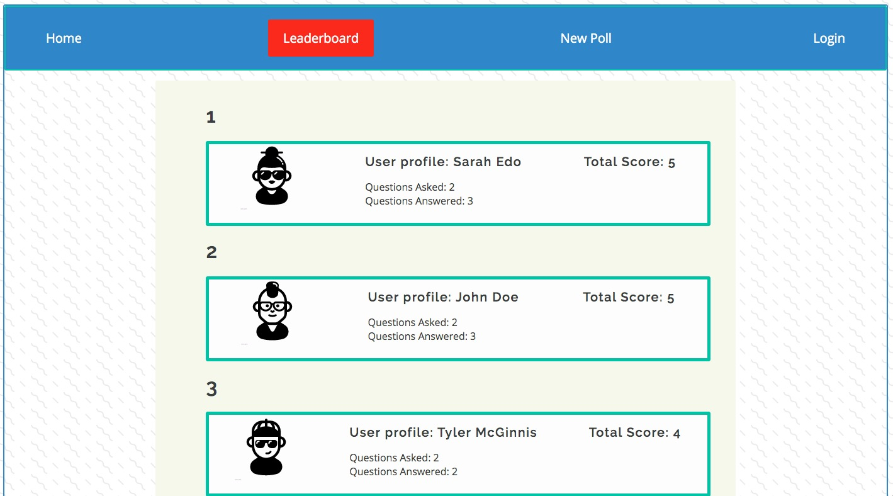
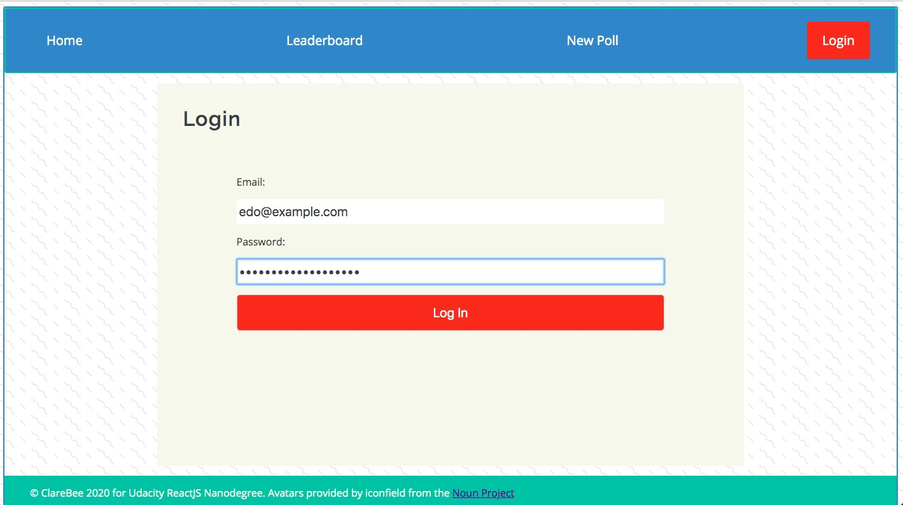
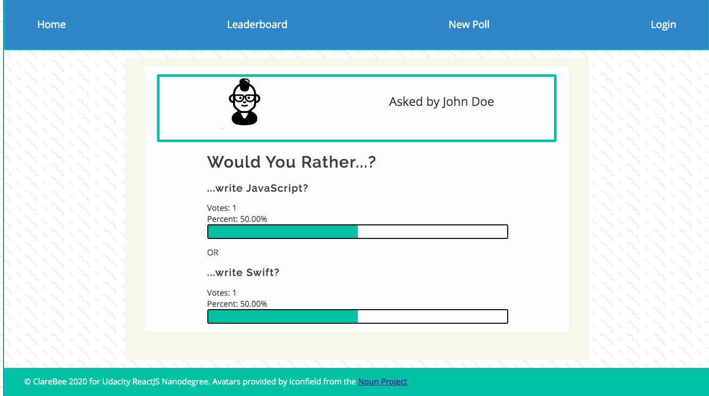

# Udacity Redux Project: Would You Rather?

## Get Started

`yarn start`

Launches on `localhost:3000`

## Login

Choose from the following hard-coded users:

- **email**: edo@example.com, **password**: secretPasswordSarah
- **email**: mcginnis@example.com, **password**: secretPasswordTyler
- **email**: doe@example.com, **password**: secretPasswordJohn

---

## Tech

- React, Redux, Redux Thunk, React Redux Loading, Styled-Components, PropTypes
- Based off Create-React-App

---

## Examples of some of the screens:

### Homepage

### Leaderboard

### Login Page

## Results Page

